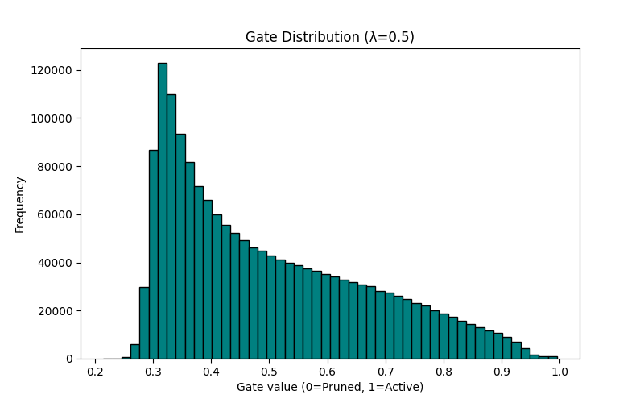

# self-pruning-neural-network
Self-pruning neural network on CIFAR-10 using learnable gates and sparsity regularization.


# Self-Pruning Neural Network (CIFAR-10)

This project was developed as part of an internship case study.
The goal is to build a neural network that can **automatically learn which weights are important and prune the rest during training**.

Instead of manually pruning the model after training, this approach allows the network to **decide during training itself** which connections to keep.

---

## 🧠 Basic Idea

In a normal neural network, every weight is always active.
In this project, each weight is paired with a **learnable gate parameter**.

During forward pass:

```python
gate = sigmoid(gate_score)
effective_weight = weight * gate
```

* If `gate ≈ 1` → weight is fully used
* If `gate ≈ 0` → weight is effectively removed

This makes pruning **differentiable**, so it can be learned using backpropagation.

---

## ⚙️ Training Objective

The model is trained using a combination of two losses:

```python
Total Loss = CrossEntropyLoss + λ × SparsityLoss
```

### 1. Classification Loss

* Standard cross-entropy loss
* Helps the model learn CIFAR-10 classification

### 2. Sparsity Loss

* L1 norm of all gate values
* Encourages gates to move toward zero
* This is what drives pruning

### 3. Lambda (λ)

* Controls pruning strength

| λ value  | Effect                  |
| -------- | ----------------------- |
| Small λ  | Almost no pruning       |
| Medium λ | Balanced pruning        |
| Large λ  | Over-pruning (collapse) |

---

## 📊 Results

### Gate Distribution (λ = 0.5)



### Observations

* Gate values are distributed between **~0.3 and 1.0**
* This indicates the model is learning to:

  * Keep important weights
  * Reduce less important ones

### Comparison

* **λ = 2.0**

  * Most gates collapse near 0
  * Model over-prunes

* **λ = 0.5**

  * More balanced distribution
  * Better learning behavior

---

## 🚀 How to Run the Project

### Step 1: Install dependencies

```bash
pip install -r requirements.txt
```

### Step 2: Train the model

```bash
python train.py
```

### Step 3: Inspect gate distribution

```bash
python inspect_gates.py
```

This script prints:

* min / mean / max gate values
* percentage of pruned weights
* whether distribution is bimodal

---

## 📁 Project Structure

```
model.py          → PrunableLinear + SelfPruningNet
utils.py          → Data loading, evaluation, plotting
train.py          → Training loop and experiments
inspect_gates.py  → Gate analysis script
requirements.txt  → Dependencies
```

---

## 🔍 Key Insights

* Neural networks are often **over-parameterized**
* Many weights are not necessary for good performance
* With sparsity regularization, the model can:

  * Reduce unnecessary weights
  * Maintain reasonable accuracy
* The pruning behavior depends heavily on λ

---

## ⚠️ Limitations

* Model is a simple MLP → accuracy is limited (~55–58%)
* Results depend strongly on hyperparameter tuning
* Did not achieve perfect bimodal distribution in all cases
* No hard pruning (weights are not permanently removed)

---

## 💡 Future Improvements

* Apply this method to **CNN architectures**
* Add **hard threshold pruning**
* Measure:

  * FLOPs reduction
  * Model size reduction
* Experiment with:

  * dynamic λ scheduling
  * different regularization methods

---

## 🏁 Conclusion

This project demonstrates that a neural network can **learn to prune itself during training** using learnable gates and sparsity regularization.

It highlights the trade-off between:

* Model performance
* Model sparsity

---

## 👤 Author

Student implementation for internship case study
